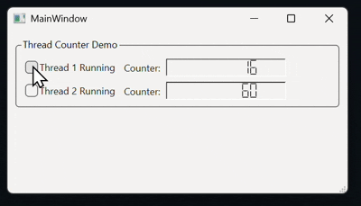
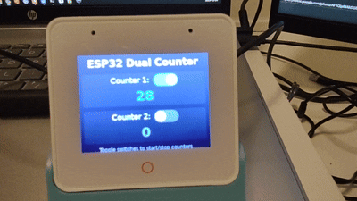

# Qt Projects Sandbox

This directory contains Qt demonstration projects for desktop and embedded platforms.

## Projects

### 1. JimFirstQtWidgetApp

A Qt Widgets application demonstrating multi-threading, signal/slot communication, and thread-safe UI updates.

### 2. ESP32DualCounter

## Features

- **Two independent worker threads** that increment counters concurrently
- **Interactive UI** with controls to start/stop each thread
- **Real-time counter displays** 
- **Thread-safe communication** using Qt's signal/slot mechanism with QMutex

- **Same app running on desktop and microcontroller**

### Key Qt Concepts Demonstrated

1. **QThread subclassing**: Override `run()` for custom thread behavior
2. **Cross-thread signals**: Automatic queued connections for thread-safe UI updates
3. **QMutex**: Prevent race conditions on shared data
4. **Qt Widgets**: Checkboxes, labels, LCD displays, layouts
5. **Qt UI Designer**: Visual layout with `.ui` files

## Usage

1. Run the application
2. Check "Thread 1 Running" to start the first counter
3. Check "Thread 2 Running" to start the second counter
4. Uncheck to stop threads
5. Observe both counters incrementing independently (every 100ms)

## Learning Resources

- [Qt Documentation](https://doc.qt.io/)
- [Qt Threading Basics](https://doc.qt.io/qt-6/thread-basics.html)
- [Signals and Slots](https://doc.qt.io/qt-6/signalsandslots.html)

